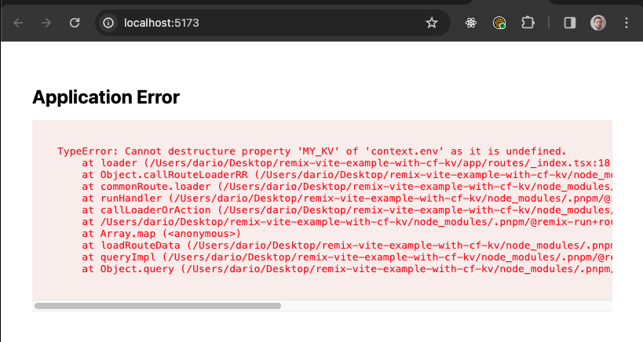
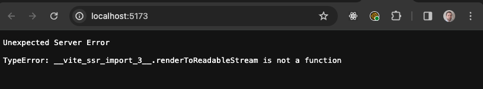

# Remix Demo of using a Cloudflare KV (with Vite)

Start by installing the dependencies:
```
pnpm i
```

## Old Remix Flow

To run the application locally using the old remix dev mode:
```
pnpm dev:old
```

To deploy the application:
```
# build the application
pnpm build 
# and deploy it
pnpm run deploy
```

> [!NOTE]
> The above is all that's needed with the current Remix workflow, developers work on their app which is served by `wrangler pages dev` so it is faithfully representing how the app is going to work when actually deployed to the Cloudflare networks

## Vite Flow

To run the application locally using the vite run:
```
pnpm dev:vite
```

> [!NOTE]
> Bindings aren't currently integrated with the vite plugin so the app is not actually going to render properly and you are going to see the following error:
> 

> [!IMPORTANT]
> Please notice that the above shows a standard application error rendered by the default Remix error boundary, showing that there in an application error but the Remix application is indeed running.
> This works thanks to this import: `import { renderToReadableStream } from "react-dom/server.browser";` if you try to remove the `.browser` suffix, the whole application as a whole won't run anymore and you'll just get the following error
> 

To preview the application locally (not using Vite):
```
# build the application
pnpm build
# and preview it
pnpm run pages:preview
```

To deploy the application:
```
# build the application
pnpm build 
# and deploy it
pnpm run deploy
```

